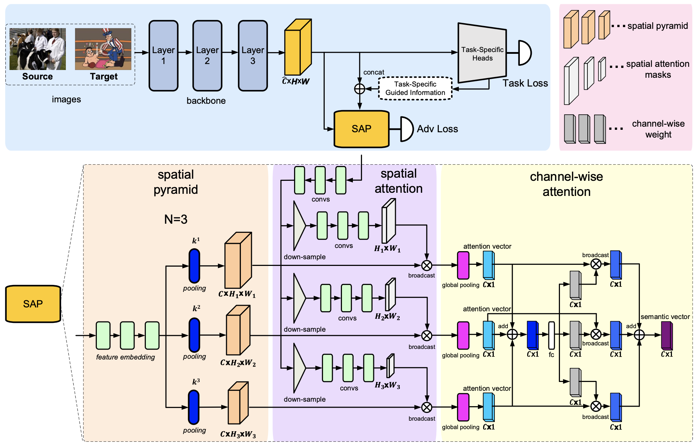

@DAVIDE: per farlo girare da te, devi controllare/mappare in docker i seguenti percorsi:

- In configs/adv_vgg16_wolves_park1_wolves_park2.yaml, ultima riga: WORK_DIR
- In detection/data/build.py da riga 161 a riga 179 i percorsi dei dataset

Il resto dovrebbe essere liscio

# Spatial Attention Pyramid Network for Unsupervised Domain Adaptation

## Introduction

This paper was accepted to ECCV 2020.

Unsupervised domain adaptation is critical in various computer vision tasks, such as object detection, instance segmentation, and semantic segmentation, which aims to alleviate performance degradation caused by domain-shift. Most of previous methods rely on a single-mode distribution of source and target domains to align them with adversarial learning, leading to inferior results in various scenarios. To that end, in this paper, we design a new spatial attention pyramid network for unsupervised domain adaptation. Specifically, we first build the spatial pyramid representation to capture context information of objects at different scales. Guided by the task-specific information, we combine the dense global structure representation and local texture patterns at each spatial location effectively using the spatial attention mechanism. In this way, the network is enforced to focus on the discriminative regions with context information for domain adaption. We conduct extensive experiments on various challenging datasets for unsupervised domain adaptation on object detection, instance segmentation, and semantic segmentation, which demonstrates that our method performs favorably against the state-of-the-art methods by a large margin.



## Install 

Requirements (Please install latest version):

```
torch
torchvision
terminaltables
Pillow
yacs
pycocotools
```

## Datasets

- CitysScape, FoggyCityscape: [Cityscape](https://www.cityscapes-dataset.com/). Processed COCO format annotations can be downloaded from [Google Drive](https://drive.google.com/file/d/1Y2gU_FSUS8n9VM2ZM7UmmShZlI_q-wYm/view?usp=sharing).
- [KITTI](http://www.cvlibs.net/datasets/kitti/)
- [PASCAL VOC](http://host.robots.ox.ac.uk/pascal/VOC/)
- [Sim10k](https://fcav.engin.umich.edu/sim-dataset/)

Script to download clipart watercolor comic:

```sh
#!/usr/bin/env bash

names=(clipart watercolor comic)
for name in "${names[@]}"
do
    curl -O http://www.hal.t.u-tokyo.ac.jp/~inoue/projects/cross_domain_detection/datasets/${name}.zip
    unzip ${name}.zip
    rm ${name}.zip
done
```

Please convert to VOC format after downloading.

## Run

Train a model:

```
python -m torch.distributed.launch --nproc_per_node=8 --master_port=10086 --use_env adversarial_train.py --config-file <path_to_config>
```

Test a model:

```
python -m torch.distributed.launch --nproc_per_node=8 --master_port=10086 --use_env adversarial_train.py --config-file <path_to_config> --test-only
```

## Others

Unofficial Detectron2 Implementation: https://github.com/Shuntw6096/sap-da-detectron2
